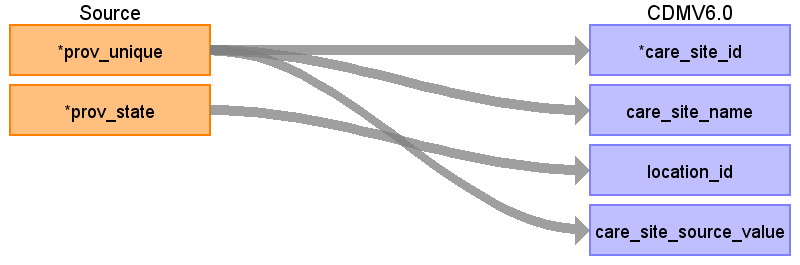
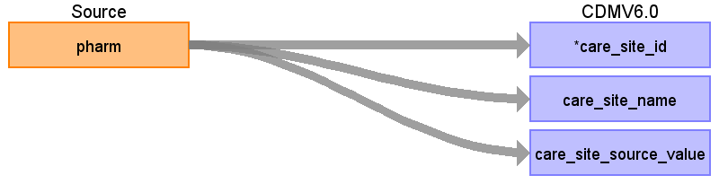

# CDM Table: CARE_SITE

Will be derived from two fields in two different tables. **PROVIDER**.PROV_UNIQUE,  limited to Prov_Type in (empty, '2', '3', '4', '5'), and distinct values in  field **RX_CLAIMS**.Pharm (indicates pharmacy).

**Note**: OPTUM DOD/SES has two provider tables **PROVIDER** and **PROVIDER_BRIDGE**. **PROVIDER** table takes advantage of known information about providers/facilities to consolidate multiple provider IDs for the same provider/facility into a better single identifier (Master Provider index). PROV field from medical table and the identifiers NPI/DEA from pharmacy tables link to PROVIDER_BRIDGE table. The NPI and DEA are encrypted ids. The purpose of the PROVIDER_BRIDGE  table is to link PROVIDER table to medical/pharmacy claims tables to get information such as credentials or specialty information. When looking up a CARE_SITE_ID using the PROV listed in **MEDICAL_CLAIMS** or **RX_CLAIMS**, it is necessary to use the **PROVIDER_BRIDGE** table first to find the **PROV_UNIQUE**, which is stored as the CARE_SITE_SOURCE_VALUE.

## **CARE_SITE Table Logic**

- When source table has PROV as an identified for provider/care_site, it will crosswalked to PROV_UNIQUE using **PROVIDER_BRIDGE**. All provider_source value will be populated by PROV_UNIQUE.
- DEA and NPI are encrypted and not used in ETL

#### **Mapping Place of Service**
PROV_TYPE based on PROV_UNIQUE

PROV_TYPE|DESCRIPTION|OMOP Concept_Id
:-----:|:-----:|:-----:
2|Hospital|8717
3|Group Practice|38004693
4|Other Facility|0
5, empty|Unknown|0

If CARE_SITE_SOURCE_VALUE from **RX_CLAIMS**.Pharm set PLACE_OF_SERVICE_CONCEPT_ID to 38004340 and PLACE_OF_SERVICE_SOURCE_VALUE to Pharmacy.

## **Mapping the CARE_SITE table**
### From the PROVIDER table

### From the RX_CLAIMS table

**Destination Field**|**Source Field**|**Applied Rule**|**Comment**
:-----:|:-----:|:-----:|:-----:
CARE_SITE_ID|<system generated>|**PROVIDER** Prov_Unique or distinct **RX_CLAIMS** Pharm |
CARE_SITE_NAME|**PROVIDER** Prov_Unique or distinct **RX_CLAIMS** Pharm | |
PLACE_OF_SERVICE_CONCEPT_ID|Derived Field|[See logic above](#Mapping_Place_of_Service) |
LOCATION_ID|**PROVIDER** prov_region|FK to Location table|
CARE_SITE_SOURCE_VALUE|**PROVIDER** Prov_Unique   **RX_CLAIMS** Pharm| |
PLACE_OF_SERVICE_SOURCE_VALUE|Derived Field|Put the description of the **PROV_TYPE** here.  [See logic above](#Mapping_Place_of_Service)|

---
*Common Data Model ETL Mapping Specification for Optum Extended SES & Extended DOD*
 *CDM Version = 5.4.0, Clinformatics Version = v9.0*

### 3-Nov-2023
- Clinformatics Version = v8.0 -> v9.0
- CDM v6.0 -> V5.4
- STATE - provider.prov_state ->provider.prov_region