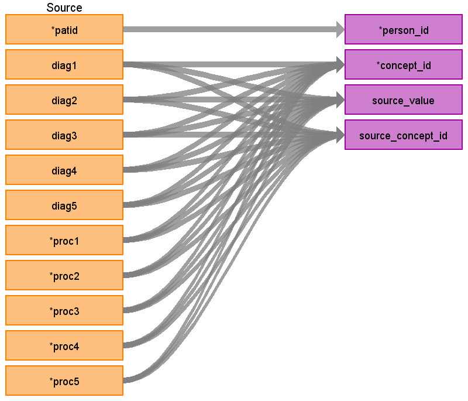

# CDM Table: STEM 

The STEM table is a staging area where source codes like ICD9 codes will first be mapped to concept_ids. The STEM table itself is an amalgamation of the OMOP event tables to facilitate record movement. This means that all fields present across the OMOP event tables are present in the STEM table. After a record is mapped and staged, the domain of the concept_id dictates which OMOP table (Condition_occurrence, Drug_exposure, Procedure_occurrence, Measurement, Observation, Device_exposure) the record will move to. Please see the STEM -> CDM mapping files for a description of which STEM fields move to which STEM tables.

### **Notes**
- VISIT_DETAIL must be built before STEM (refer to [VISIT_DETAIL file](VISIT_DETAIL.md))
- The **INPATIENT_CONFINEMENT** table can be joined to **VISIT_DETAIL**. 
- Referential integrity is maintained with VISIT_DETAIL. 
- For every record in **STEM** there should be 1 row record in VISIT_DETAIL (n:1 join). 
- For every record in **VISIT_DETAIL** there may be 0 to n rows in **STEM**.

## **Mapping from INPATIENT_CONFINEMENT**

|**Destination Field**|**Source Field**|**Applied Rule**|**Comment**|
| :----: | :----: | :--------: | :------: |
| id |  |Autogenerate||
| domain_id ||This should be the domain_id of the standard concept in the CONCEPT_ID field. If a code is mapped to CONCEPT_ID 0, put the domain_id as Observation.||
| person_id | patid| Use patid to lookup Person_id ||
| visit_detail_id |**VISIT_DETAIL** VISIT_DETAIL_ID|||
| visit_occurrence_id |**VISIT_DETAIL** VISIT_OCCURRENCE_ID|Use the linking to **VISIT_DETAIL** to look up VISIT_OCCURRENCE_ID||
| provider_id |**VISIT_DETAIL** PROVIDER_ID |||
| start_datetime |**VISIT_DETAIL** VISIT_DETAIL_START_DATETIME |||
| concept_id | **INPATIENT_CONFINEMENT** DIAG1-DIAG5 and PROC1-PROC5|Use the SOURCE_TO_STANDARD query with the filterS  **DIAG Filters** WHERE TARGET_STANDARD_CONCEPT = 'S' AND TARGET_INVALID_REASON IS NULL AND SOURCE_VOCABULARY_ID IN *ICD9CM* OR *ICD10CM*    **PROC Filters**  WHERE SOURCE_VOCABULARY_ID IN (*'ICD9Proc'* OR *'ICD10PCS'*, 'HCPCS','CPT4') AND TARGET_STANDARD_CONCEPT ='S' AND TARGET_INVALID_REASON IS NULL AND TARGET_CONCEPT_CLASS_ID NOT IN ('HCPCS Modifier','CPT4 Modifier')| **DIAG Filters** If ICD_FLAG = 9 then use 'ICD9CM', else if ICD_FLAG = 10 then use 'ICD10CM'  **Proc Filters** If ICD_FLAG = 9 then use 'ICD9Proc', else if ICD_FLAG = 10 then use 'ICD10PCS'  If a DIAG or PROC does not have a mapping set the concept_id to 0||
| source_value |**INPATIENT_CONFINEMENT** DIAG1-DIAG5 and PROC1-PROC5|||
| source_concept_id |**INPATIENT_CONFINEMENT** DIAG1-DIAG5 and PROC1-PROC5|Use the SOURCE_TO_SOURCE query with the filter   **DIAG Filters** WHERE SOURCE_VOCABULARY_ID IN *ICD9CM* OR *ICD10CM*    **PROC Filters**  WHERE SOURCE_VOCABULARY_ID IN (*'ICD9Proc'* OR *'ICD10PCS'*, 'HCPCS','CPT4') | **DIAG Filters** If ICD_FLAG = 9 then use 'ICD9CM', else if ICD_FLAG = 10 then use 'ICD10CM'  **Proc Filters** If ICD_FLAG = 9 then use 'ICD9Proc', else if ICD_FLAG = 10 then use 'ICD10PCS'|
| type_concept_id |32855 (Inpatient claim header) |||  
| operator_concept_id | |||
| unit_concept_id |  |||
| unit_source_value | |||
| start_date | **VISIT_DETAIL** VISIT_DETAIL_START_DATE||| 
| end_date |  |||
| range_high |  |||
| range_low | |||
| value_as_number | |||
| value_as_string | |||
| value_as_concept_id | |||
| value_source_value | |||
| end_datetime | |||
| verbatim_end_date |  |||
| days_supply | |||
| dose_unit_source_value | |||
| lot_number | |||
| modifier_concept_id |  |||
| modifier_source_value | |||
| quantity | |||
| refills | |||
| route_concept_id | |||
| route_source_value | |||
| sig |  |||
| stop_reason | |||
| unique_device_id | |||
| anatomic_site_concept_id | |||
| disease_status_concept_id |  |||
| specimen_source_id ||||
| anatomic_site_source_value | |||
| disease_status_source_value | |||
| condition_status_concept_id | |||
| condition_status_source_value | |||