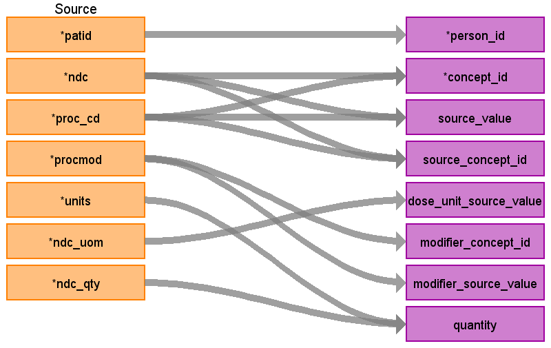

# CDM Table: STEM 

The STEM table is a staging area where source codes like ICD9 codes will first be mapped to concept_ids. The STEM table itself is an amalgamation of the OMOP event tables to facilitate record movement. This means that all fields present across the OMOP event tables are present in the STEM table. After a record is mapped and staged, the domain of the concept_id dictates which OMOP table (Condition_occurrence, Drug_exposure, Procedure_occurrence, Measurement, Observation, Device_exposure) the record will move to. Please see the STEM -> CDM mapping files for a description of which STEM fields move to which STEM tables.

### **Notes**
- VISIT_DETAIL must be built before STEM (refer to [VISIT_DETAIL file](VISIT_DETAIL.md))
- The **MEDICAL_CLAIMS** table can be joined to **VISIT_DETAIL**. 
- Referential integrity is maintained with VISIT_DETAIL. 
    - For every record in **STEM** there should be 1 row record in VISIT_DETAIL (n:1 join). 
    - For every record in **VISIT_DETAIL** there may be 0 to n rows in **STEM**.

### **Revenue Code Mappings** 
Records will be written from the **MEDICAL_CLAIMS** table mapping the field **RVNU_CD** to **STEM.CONCEPT_ID**. Please see the table below for how this logic will be handled. 
- **NOTE** the revenue codes are mapped to concepts with the vocabulary_id "Revenue Code". All these concepts have the domain of "Revenue Code" as well. Since there is no revenue table, all records coming from the **RVNU_CD** field should go to the **OBSERVATION** table.

### Procedure Modifier codes
If a record is written to STEM from the **PROC_CD** field in the **MEDICAL_CLAIMS** table, and if the **PROCMOD** field is JW, then remove the record as 'JW' means 'amount not administered'. If the **PROCMOD** field has any other value, populate the **MODIFIER_CONCEPT_ID** and **MODIFIER_SOURCE_VALUE** fields in STEM using the **PROCMOD** value.

## **Mapping from MEDICAL_CLAIMS**

|**Destination Field**|**Source Field**|**Applied Rule**|**Comment**|
| :----: | :----: | :--------: | :------: |
| id |  |Autogenerate||
| domain_id ||This should be the domain_id of the standard concept in the CONCEPT_ID field. If a code is mapped to CONCEPT_ID 0, put the domain_id as Observation.||
| person_id | patid| Use patid to lookup Person_id ||
| visit_detail_id |**VISIT_DETAIL** VISIT_DETAIL_ID|||
| visit_occurrence_id |**VISIT_DETAIL** VISIT_OCCURRENCE_ID|Use the linking to **VISIT_DETAIL** to look up VISIT_OCCURRENCE_ID|||
| provider_id |**VISIT_DETAIL** PROVIDER_ID |||
| start_datetime |**VISIT_DETAIL** VISIT_DETAIL_START_DATETIME |||
| concept_id | **MEDICAL_CLAIMS** PROC_CD  **MEDICAL_CLAIMS** NDC  **MEDICAL_CLAIMS** RVNU_CD|Use the SOURCE_TO_STANDARD query with the filter  **PROC_CD**  WHERE SOURCE_VOCABULARY_ID IN (*'ICD9Proc'* OR *'ICD10PCS'*, 'HCPCS','CPT4') AND TARGET_STANDARD_CONCEPT ='S' AND TARGET_INVALID_REASON IS NULL AND TARGET_CONCEPT_CLASS_ID NOT IN ('HCPCS Modifier','CPT4 Modifier')  **NDC**  WHERE SOURCE_VOCABULARY_ID IN ('NDC') AND TARGET_STANDARD_CONCEPT ='S' AND TARGET_INVALID_REASON IS NULL AND VISIT_DETAIL_START_DATE BETWEEN SOURCE_VALID_START_DATE AND SOURCE_VALID_END_DATE  **RVNU_CD**  WHERE SOURCE_VOCABULARY_ID IN (*'Revenue Code'*) AND TARGET_STANDARD_CONCEPT ='S' AND TARGET_INVALID_REASON IS NULL| **PROC_CD**  If ICD_FLAG = 9 then use 'ICD9Proc', else if ICD_FLAG = 10 then use 'ICD10PCS' If a PROC or NDC does not have a mapping, set the concept_id to 0   **RVNU_CD** The concepts in the **Revenue Code** vocabulary all have the domain "Revenue Code". These should go to the **OBSERVATION** table.||
| source_value |**MEDICAL_CLAIMS** PROC_CD  **MEDICAL_CLAIMS** NDC  **MEDICAL_CLAIMS** RVNU_CD|||
| source_concept_id |**MEDICAL_CLAIMS** PROC_CD  **MEDICAL_CLAIMS** NDC  **MEDICAL_CLAIMS** RVNU_CD|Use the SOURCE_TO_SOURCE query with the filter  **PROC_CD** WHERE SOURCE_VOCABULARY_ID IN (*'ICD9Proc'* OR *'ICD10PCS'*)  **NDC**  WHERE SOURCE_VOCABULARY_ID IN ('NDC') AND VISIT_DETAIL_START_DATE BETWEEN SOURCE_VALID_START_DATE AND SOURCE_VALID_END_DATE  **RVNU_CD**  WHERE SOURCE_VOCABULARY_ID IN ('Revenue Code') |**PROC_CD** If ICD_FLAG = 9 then use 'ICD9Proc', else if ICD_FLAG = 10 then use 'ICD10PCS'|
| type_concept_id |32810 (Claim)|||  
| operator_concept_id | |||
| unit_concept_id | |||
| unit_source_value | |||
| start_date | **VISIT_DETAIL** VISIT_DETAIL_START_DATE, for drugs - fst_dt||| 
| end_date | **VISIT_DETAIL** VISIT_DETAIL_END_DATE, for drugs - fst_dt |||
| range_high | |||
| range_low | |||
| value_as_number | |||
| value_as_string | |||
| value_as_concept_id | |||
| value_source_value | |||
| end_datetime | **VISIT_DETAIL** VISIT_DETAIL_START_DATETIME, for drugs - fst_dt |||
| verbatim_end_date | |||
| days_supply | |If record is created using **MEDICAL_CLAIMS** NDC set days_supply to 1||
| dose_unit_source_value |**NDC** **MEDICAL_CLAIMS** NDC_UOM |||
| lot_number | |||
|MODIFIER_CONCEPT_ID|**MEDICAL_CLAIMS** PROCMOD| Use SOURCE_TO_STANDARD query and filter with `WHERE SOURCE_CONCEPT_CLASS_ID IN ('CPT4 Modifier') AND TARGET_CONCEPT_CLASS_ID IN ('CPT4 Modifier')`| Populate only if record is created using  **MEDICAL_CLAIMS** PROC_CD. If PROCMOD = 'JW' then remove the record as 'JW' means 'amount not administered'.|
| modifier_source_value | **MEDICAL_CLAIMS** PROCMOD|||
| quantity | **PROC_CD** **MEDICAL_CLAIMS** UNITS  **NDC** **MEDICAL_CLAIMS** NDC_QTY|||
| refills | |||
| route_concept_id | |||
| route_source_value | |||
| sig |  |||
| stop_reason | |||
| unique_device_id | |||
| anatomic_site_concept_id | |||
| disease_status_concept_id |  |||
| specimen_source_id ||||
| anatomic_site_source_value | |||
| disease_status_source_value | |||
| condition_status_concept_id | |||
| condition_status_source_value | |||

## Change log

### 13-Nov-2023
Set drug start and end dates as fst_dt - dates are extracted from the med_claims table itself

### October 23, 2025
Added logic about remove records where procmod = 'JW'