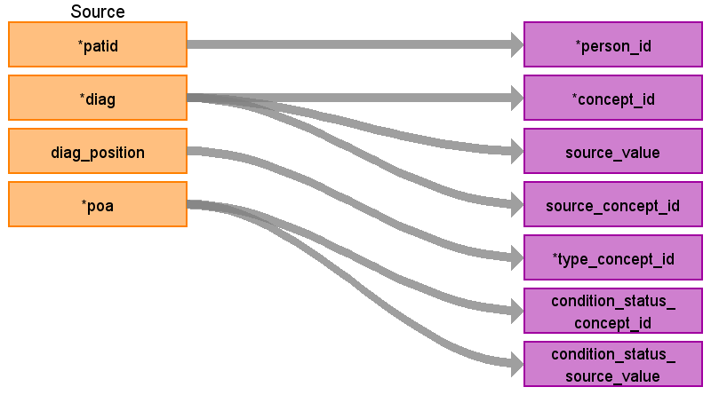

# CDM Table: STEM 

The STEM table is a staging area where source codes like ICD9 codes will first be mapped to concept_ids. The STEM table itself is an amalgamation of the OMOP event tables to facilitate record movement. This means that all fields present across the OMOP event tables are present in the STEM table. After a record is mapped and staged, the domain of the concept_id dictates which OMOP table (Condition_occurrence, Drug_exposure, Procedure_occurrence, Measurement, Observation, Device_exposure) the record will move to. Please see the STEM -> CDM mapping files for a description of which STEM fields move to which STEM tables.

### **Notes**
- VISIT_DETAIL must be built before STEM (refer to [VISIT_DETAIL file](VISIT_DETAIL.md))
- The **MED_DIAGNOSIS** table can be joined to **MEDICAL_CLAIMS** which is joined to **VISIT_DETAIL**. 
- Referential integrity is maintained with VISIT_DETAIL. 
- For every record in **STEM** there should be 1 row record in VISIT_DETAIL (n:1 join). 
- For every record in **VISIT_DETAIL** there may be 0 to n rows in **STEM**.

## **Mapping from MED_DIAGNOSIS**
- Take the records from **MEDICAL_CLAIMS** and join them to **MED_DIAGNOSIS** on 
    - clmid = clmid
    - loc_cd = loc_cd
    - fst_dt = fst_dt
    - pat_planid = pat_planid
    - This will assign each diagnosis at least one **VISIT_DETAIL** VISIT_DETAIL_ID based on the lookup created during VISIT_DETAIL creation. If more than one is assigned, choose one.  

- The ICD_FLAG field in **MED_DIAGNOSIS** defines if the claim is using ICD9 or ICD10.
    - If ICD_FLAG is 9, then use VOCABULARY_ID = 'ICD9CM'
    - If ICD_FLAG is 10, then use VOCABULARY_ID = 'ICD10CM'
-   Optum removes decimal points from ICD diagnoses so when mapping to the OMOP Vocabulary, the decimal points need to also be removed from the vocabulary in order to map between the source and the vocabulary.
- START_DATE is assigned to VISIT_DETAIL_START_DATE
- The VISIT_DETAIL.VISIT_OCCURRENCE_ID and VISIT_DETAIL.VISIT_DETAIL_ID are FK in STEM table.

|**Destination Field**|**Source Field**|**Applied Rule**|**Comment**|
| :----: | :----: | :--------: | :------: |
| id | |Autogenerate||
| domain_id ||This should be the domain_id of the standard concept in the CONCEPT_ID field. If a code is mapped to CONCEPT_ID 0, put the domain_id as Observation.||
| person_id | patid| Use patid to lookup Person_id ||
| visit_detail_id |**VISIT_DETAIL** VISIT_DETAIL_ID|||
| visit_occurrence_id |**VISIT_DETAIL** VISIT_OCCURRENCE_ID|Use the linking to **VISIT_DETAIL** to look up VISIT_OCCURRENCE_ID||
| provider_id |**VISIT_DETAIL** PROVIDER_ID |||
| start_datetime |**VISIT_DETAIL** VISIT_DETAIL_START_DATETIME |||
| concept_id | **MED_DIAGNOSIS** DIAG|Use the SOURCE_TO_STANDARD query with the filter  WHERE SOURCE_VOCABULARY_ID IN (*'ICD9CM'* OR *'ICD10CM'*) AND TARGET_STANDARD_CONCEPT ='S' AND TARGET_INVALID_REASON IS NULL |If ICD_FLAG = 9 then use 'ICD9CM', else if ICD_FLAG = 10 then use 'ICD10CM'||
| source_value | **MED_DIAGNOSIS** DIAG|||
| source_concept_id |**MED_DIAGNOSIS** DIAG |Use the SOURCE_TO_SOURCE query with the filter  WHERE SOURCE_VOCABULARY_ID IN (*'ICD9CM'* OR *'ICD10CM'*) |If ICD_FLAG = 9 then use 'ICD9CM', else if ICD_FLAG = 10 then use 'ICD10CM'|
| type_concept_id | 32810 (Claim)|  ||
| end_datetime | |||
| condition_status_concept_id | **MED_DIAGNOSIS** POA, DIAG_POSITION| If POA = Y and DIAG_POSITION = 01 then 32901   If DIAG_POSITION = 01 and POA is not Y then 32902  If POA = Y and DIAG_POSITION is not 01 then 32890||
| condition_status_source_value | **MED_DIAGNOSIS** POA, DIAG_POSITION | Concatenate the values in these two fields together with a semi-colon inbetween||
