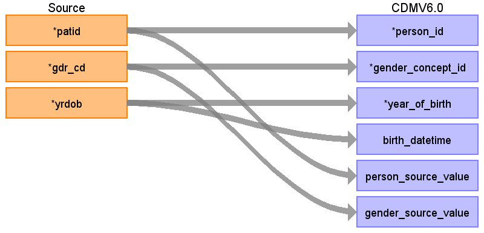
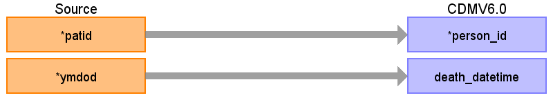

# CDM Table: PERSON

The information in the PERSON table is sourced from the  **Member_Continuous_Enrollment** table. This table can contain multiple records per person, each record representing a period of time the person was enrolled in a health benefit Plan. These records are consolidated using the logic below to create one record per person in the PERSON table.

## PERSON Table Logic

- Delete person if gender (GDR_CD) changed over different enrollment period.
- Delete person if there is more than one YRDOB, such that max(YRDOB) > min(YRDOB) +2.
- Choose last/recent record for person: 
    - Sort **Member_Continuous_Enrollment** by ascending order of ELIGEFF and ELIGEND to identify last/recent record by person. 
    - Use persons demographics information from this record as the values to populate the PERSON table, 
- After finding the last/recent record for a person, delete person if demographics meet any of the following criteria
    - YEAR_OF_BIRTH < 1900
    - YEAR_OF_BIRTH > CURRENT_YEAR
    - YEAR_OF_BIRTH > Min(Year(ELIGEFF)) +1
    - **Member_Continuous_Enrollment** GDR_CD is not M or F (not Male or Female).
- How to determine MONTH_OF_BIRTH and DAY_OF_BIRTH. 
    - if person has enrollment in the year of birth, then MONTH_OF_BIRTH = MONTH(MIN(ELIGEFF)) and DAY_OF_BIRTH = 1st day of the month. 
    - For datetime values, when time is not available, default to UTC timezone mid-night 00:00:00
 
### **Mapping of source field values to OMOP Vocabulary concept id**

#### **Mapping Gender**

|**GDR_CD**|**DESCRIPTION**|**OMOP Concept_Id**|
|:-----:|:-----:|:-----:|
|M|Male|8507|
|F|Female|8532|

#### **Mapping Race**

|**Race**|**DESCRIPTION**|**OMOP Concept_Id**|
|:-----:|:-----:|:-----:|
|A|Asian|8515|
|B|Black|8516|
|H|Hispanic|0|
|W|White|8527|
|U, Blank, or *NULL*|Unknown|0|

#### **Mapping Ethnicity**

|Race|DESCRIPTION|OMOP Concept_Id|
|:-----:|:-----:|:-----:|
|A|Asian|38003564|
|B|Black|38003564|
|H|Hispanic|38003563|
|W|White|38003564|
|U, Blank, or *NULL*|Unknown|0|

------------------

## **Mapping the PERSON table**

### From the MEMBER_CONTINUOUS_ENROLLMENT table

### From the DEATH table

|**Destination Field**|**Source Field**|**Applied Rule**|**Comment**|
|:-----:|:-----:|:-----:|:-----:|
|PERSON_ID|**Member_Continuous_Enrollment** PATID| | |
|GENDER_CONCEPT_ID|**Member_Continuous_Enrollment** GDR_CD|[See mapping](#Mapping-Gender)||
|YEAR_OF_BIRTH|**Member_Continuous_Enrollment** YRDOB||
|MONTH_OF_BIRTH|Derived field|[See logic above](#PERSON-Table-Logic)|
|DAY_OF_BIRTH|Derived field|[See logic above](#PERSON-Table-Logic)|
|BIRTH_DATETIME|**Member_Continuous_Enrollment** YRDOB   **PERSON** MONTH_OF_BIRTH   **PERSON** DAY_OF_BIRTH   UTC tz midnight|Concatenate the source field values into datetime value with UTC Timezone|
|DEATH_DATETIME|**(DOD only) DEATH** YMDOD|Set the day to the last day of the month and set time to UTC tz midnight|
|RACE_CONCEPT_ID|**(SES only)** **SES** D_RACE_CODE|[See Race mapping](#Mapping-Race)|This data does not exist for DOD so this should be set to 0 for persons in the DOD database.|
|ETHNICITY_CONCEPT_ID|**(SES only)** **SES**  D_RACE_CODE |[See Ethnicity mapping](#Mapping-Race)|This data does not exist for DOD so this should be set to 0 for persons in the DOD database.|
|LOCATION_ID|FK to Location table.|Represents the last known location for person in **Member_Continuous_Enrollment**. For **SES** the field is DIVISON, and **DOD** it is STATE||
|PROVIDER_ID||| |
|CARE_SITE_ID|| | |
|PERSON_SOURCE_VALUE|**Member_Continuous_Enrollment** PATID|||
|GENDER_SOURCE_VALUE|**Member_Continuous_Enrollment** GDR_CD|||
|GENDER_SOURCE_CONCEPT_ID||0||
|RACE_SOURCE_VALUE|**(SES only) SES** D_RACE_CODE |`If D_RACE_CODE in ('W','A','U','B')`|This data does not exist for DOD so this should be set to NULL for persons in the DOD database.|
|RACE_SOURCE_CONCEPT_ID||0||
|ETHNICITY_SOURCE_VALUE|**(SES only)** **SES** D_RACE_CODE|`If D_RACE_CODE = 'H'`|This data does not exist for DOD so this should be set to NULL for persons in the DOD database.|
|ETHNICITY_SOURCE_CONCEPT_ID||0||

---
*Common Data Model ETL Mapping Specification for Optum Extended SES & Extended DOD*
 CDM Version = 5.4

## Change log

### 11-Aug-2023

- Death logic is removed since in CDM v5.4 the death table is present itself (not in person table)
