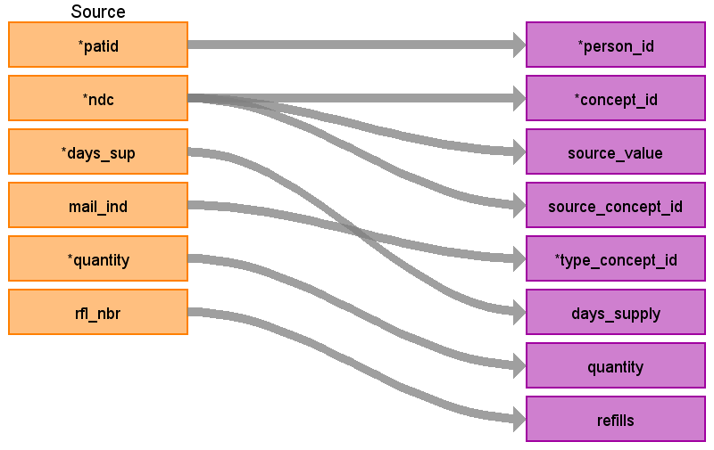

# CDM Table: STEM 

The STEM table is a staging area where source codes like ICD9 codes will first be mapped to concept_ids. The STEM table itself is an amalgamation of the OMOP event tables to facilitate record movement. This means that all fields present across the OMOP event tables are present in the STEM table. After a record is mapped and staged, the domain of the concept_id dictates which OMOP table (Condition_occurrence, Drug_exposure, Procedure_occurrence, Measurement, Observation, Device_exposure) the record will move to. Please see the STEM -> CDM mapping files for a description of which STEM fields move to which STEM tables.

### **Notes**
- VISIT_DETAIL must be built before STEM (refer to [VISIT_DETAIL file](VISIT_DETAIL.md))
- The **RX_CLAIMS** table can be joined to **VISIT_DETAIL**. 
- The **DRUG_EXPOSURE** table will have 1:1 record level referential integrity to **RX_CLAIMS**.
- For every record in **STEM** there should be 1 row record in VISIT_DETAIL (n:1 join). 
- For every record in **VISIT_DETAIL** there may be 0 to n rows in **STEM**.

## **Mapping from RX_CLAIMS**
- Take the records from **RX_CLAIMS** and join them to **VISIT_DETAIL** based on the **VISIT_DETAIL_ID** that was assigned. 

- NDC codes are date specific so there is an extra filter for the concept id mapping to make sure it falls during the time an NDC is valid.

- Some 11 digit NDC codes are invalid and instead need to mapped to the 9-digit version. To account for this map the 11-digit NDC code to SOURCE_CODE in OMOP vocab first. If no mapping is found, map the first 9 digits of NDC code to SOURCE_CODE.

- In the **RX_CLAIMS** table some values in DAYS_SUP are invalid. Any value <= 0 or > 365 should be updated using this logic:

```
    CASE
    WHEN DAYS_SUPPLY <= 0 THEN 1
    WHEN DAYS_SUPPLY > 365 THEN 365
    WHEN DAYS_SUPPLY IS NULL THEN 1
    ELSE DAYS_SUPPLY
    END
```



|**Destination Field**|**Source Field**|**Applied Rule**|**Comment**|
| :----: | :----: | :--------: | :------: |
| id |  |Autogenerate||
| domain_id ||This should be the domain_id of the standard concept in the CONCEPT_ID field. If a code is mapped to CONCEPT_ID 0, put the domain_id as Observation.||
| person_id | **VISIT_DETAIL** PERSON_ID|  ||
| visit_detail_id |**VISIT_DETAIL**<br>VISIT_DETAIL_ID|||
| visit_occurrence_id |**VISIT_DETAIL**<br>VISIT_OCCURRENCE_ID|Use the linking to **VISIT_DETAIL** to look up VISIT_OCCURRENCE_ID||
| provider_id |**VISIT_DETAIL**<br>PROVIDER_ID |||
| start_datetime | fill_dt |||
| concept_id | NDC|Use the SOURCE_TO_STANDARD query with the filter<br/><br/>**NDC**<br> WHERE SOURCE_VOCABULARY_ID IN ('NDC') AND TARGET_STANDARD_CONCEPT ='S' AND TARGET_INVALID_REASON IS NULL AND VISIT_DETAIL_START_DATE BETWEEN SOURCE_VALID_START_DATE AND SOURCE_VALID_END_DATE| If an NDC does not have a mapping, set the concept_id to 0|
| source_value | NDC|||
| source_concept_id |NDC|Use the SOURCE_TO_SOURCE query with the filter<br/><br/>**NDC**<br> WHERE SOURCE_VOCABULARY_ID IN ('NDC') AND VISIT_DETAIL_START_DATE BETWEEN SOURCE_VALID_START_DATE AND SOURCE_VALID_END_DATE||
| type_concept_id |MAIL_IND|If MAIL_IND = 'Y' then 32857 (Mail order record) else 32869 (Pharmacy claim)||  
| operator_concept_id | |||
| unit_concept_id | |||
| unit_source_value | |||
| start_date | fill_dt||| 
| end_date ||fill_dt + days_supply - 1|first calculate days_supply|
| range_high | |||
| range_low | |||
| value_as_number | |||
| value_as_string | |||
| value_as_concept_id | |||
| value_source_value | |||
| end_datetime ||fill_dt + days_supply - 1|first calculate days_supply|
| verbatim_end_date | |||
| days_supply | DAYS_SUP|If DAYS_SUP <= 0 or is blank, set to 1, if > 365, set to 365||
| dose_unit_source_value ||||
| lot_number | |||
|MODIFIER_CONCEPT_ID|| | |
| modifier_source_value | |||
| quantity | QUANTITY|||
| refills | RFL_NBR|||
| route_concept_id | |||
| route_source_value | |||
| sig | NULL |||
| stop_reason | |||
| unique_device_id | |||
| anatomic_site_concept_id | |||
| disease_status_concept_id | |||
| specimen_source_id ||||
| anatomic_site_source_value | |||
| disease_status_source_value | |||
| condition_status_concept_id | |||
| condition_status_source_value | |||


## Change log:

### 13-Nov-2023
fixed end_date logic, fixed days_supply logic, setting it to 1 if <=0 or NULL